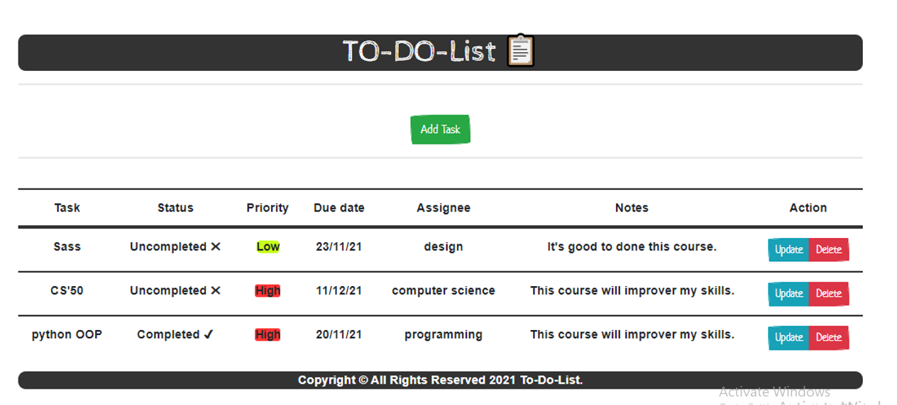

# To-Do-App 📋

## Introduction


full-stack To-Do app with Flask&Vue.js 

To-Do is a task management app to help you stay organized and manage your day-to-day.

You can use To-Do to make task lists to increase your productivity and focus on what matters to you. 

To-Do makes it easy to stay organized and manage your life.


## Tech Stack (Dependencies)

### 1. Frontend Dependencies

You must have the **HTML**, **CSS**, with [bootstrap-vue](https://bootstrap-vue.org/) for our website's frontend. 

#### Development Setup

* Project setup
```
npm install
```

* Compiles and hot-reloads for development
```
npm run serve
```

* Compiles and minifies for production
```
npm run build
```

* Lints and fixes files
```
npm run lint
```

### Customize configuration
See [Configuration Reference](https://cli.vuejs.org/config/).


### 2. Backend Dependencies

Our tech stack will include the following:
* **virtualenv** as a tool to create isolated Python environments
* **Python3** and **Flask** as our server language and server framework
* **SQLAlchemy ORM** to be our ORM library of choice
* **SQLite** as our database of choice
* You can download and install the dependencies mentioned above using `pip` as:
```
aniso8601==6.0.0
Click==7.0
Flask==1.0.3
Flask-Cors==3.0.7
Flask-RESTful==0.3.7
Flask-SQLAlchemy==2.4.0
itsdangerous==1.1.0
MarkupSafe==1.1.1
psycopg2-binary==2.8.6
python-jose==3.2.0
pytz==2019.1
six==1.12.0
SQLAlchemy==1.3.23
Werkzeug==1.0.1
```

#### Development Setup

1. **Initialize and activate a virtualenv using:**
```
py -3 -m venv venv 
source app\Scripts\activate.bat
```

2. **Install the dependencies:**
```
pip install -r requirements.txt
```

3. **Run the development server:**
```
In Bash
export FLASK_APP=app.oy
export FLASK_ENV=development # enables debug mode
flask run --reload 

In Windows
set FLASK_APP=app.py
set FLASK_ENV=development # enables debug mode
flask run --reload 
```

## Tech Stack

**Client:** HTML, CSS, Vue.js, Bootstrap-vue

**Server:** Python, Flask

## 🛠 Skills
HTML, CSS, Javascript, Vue.js, Bootstrap-vue, Python, Flask


## Author

- [@mahmoudessam820](https://github.com/mahmoudessam820)

## 🔗 Links

[](https://www.linkedin.com/in/mahmoud-el-kariouny-822719149/)
[](https://twitter.com/Mahmoud42275)


## Feedback

If you have any feedback, please reach out to us at esame4166@gmail.com

## Screenshots

### To-Do-App 


